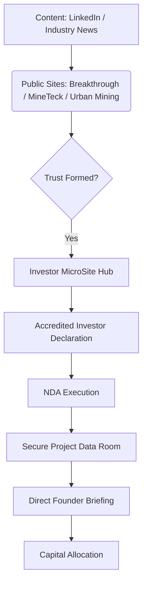

# **Revised Site Plan: MineTeck & Breakthrough Management**

**Document Version:** 2.0 (Client Delivery Edition)  
**Status:** Approved Architecture + Initial Design Execution

---

## **1. Executive Summary: The Digital Infrastructure**

This Site Plan outlines a **multi-site digital ecosystem** designed to move institutional and accredited investors through a high-trust journey: Awareness → Technical Validation → Accreditation → NDA → Capital Deployment.

This is not a traditional marketing suite; it is **Investment Infrastructure** designed to accelerate trust and reduce friction in high-stakes capital allocation.

---

## **2. Design Philosophy: "Industrial-Tech Excellence"**

To balance "cutting-edge clean tech" with "industrial scale," we have adopted a unified design language:

- **Aesthetic:** MIT Media Lab meets modern manufacturing facility.
- **Color Palette:** Deep Navy (`#1a365d`) for Trust, Metallic Gold (`#d4af37`) for Value, and Clean White for Clarity.
- **Visual Trust Markers:** Macro-photography of gold PCB circuitry, high-fidelity 3D renders of the 7-trailer MRU, and mono-spaced data strips for technical precision.

---

## **3. The 5-Site Architecture**

### **1️⃣ Breakthrough Management (Public Corporate)**

- **Role:** The "Brain" – Capital allocation philosophy and corporate governance.
- **Primary KPI:** Founder authority and institutional credibility.
- **Key CTA:** "Explore Our Investment Approach."
- **Visual Status:** [Breakthrough Mockup](file:///C:/Users/denni/.gemini/antigravity/brain/0374f495-af04-426d-acd4-720af99f8338/breakthrough_homepage_mockup_1768332032883.png)

### **2️⃣ MineTeck (Public Technology)**

- **Role:** The "Muscle" – Technical validation of the Mobile Research Unit (MRU) platform.
- **Primary KPI:** Reduction of technical skepticism.
- **Key CTA:** "See Technology in Action."
- **Visual Status:** [MineTeck Mockup](file:///C:/Users/denni/.gemini/antigravity/brain/0374f495-af04-426d-acd4-720af99f8338/mineteck_homepage_mockup_1768331998989.png)

### **3️⃣ Urban Mining (Public Micro-site / Portfolio Proof)**

- **Role:** The "Evidence" – Real-world application of philosophy + technology.
- **Primary KPI:** Proof-of-execution credibility.
- **Key CTA:** "View Portfolio Applications."
- **Visual Status:** [Urban Mining Mockup](file:///C:/Users/denni/.gemini/antigravity/brain/0374f495-af04-426d-acd4-720af99f8338/urban_mining_homepage_mockup_1768331964059.png)

### **4️⃣ Investor MicroSite (Private / Gated Hub)**

- **Role:** The "Vault" – Secure environment for qualified investors.
- **Primary KPI:** Signed NDAs and booked investor briefings.
- **Key CTA:** "Request Accredited Access."
- **Visual Status:** [Investor Mockup](file:///C:/Users/denni/.gemini/antigravity/brain/0374f495-af04-426d-acd4-720af99f8338/investor_microsite_homepage_mockup_1768332072269.png)

### **5️⃣ NDA & Project Data Room**

- **Role:** The "Diligence" – Post-NDA secure environment for deep project data.
- **Primary KPI:** Conversion to direct capital allocation conversations.
- **Gating:** HubSpot-integrated accreditation quiz → DocuSign NDA → Unlock.
- **Visual Status:** [Data Room Mockup](file:///C:/Users/denni/.gemini/antigravity/brain/0374f495-af04-426d-acd4-720af99f8338/investor_data_room_mockup_1768333277549.png)
- **Technical Blueprint:** [Data Room Wireframe](file:///g:/AI%20-%20Coding%20Projects/Minetek/Documents/Website/INVESTOR%20-%20Data%20Room%20Wireframe.md)

---

## **4. The Unified Investor Journey**

---

## **5. Technical Stack & CRM**

- **Platform:** Next.js 14 + Headless CMS (Sanity) for ultra-fast load times.
- **CRM:** HubSpot for multi-site lead tracking and relationship management.
- **Compliance:** Verifiable Reg D 506(c) gating on all financial disclosures.

---

## **6. Delivery & Implementation Roadmap**

- **Phase 1 (COMPLETE):** SitePlan Approval & Initial Concepts.
- **Phase 2:** Full-copy development for all 5 assets.
- **Phase 3:** Production development and HubSpot integration.
- **Phase 4:** Soft launch and legal compliance audit.
